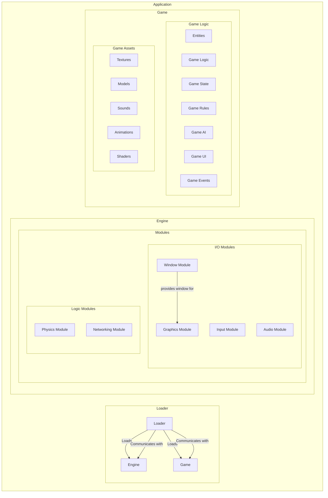

# Architecture

## Overview

How I want the engine and the game to interact with each other.

- the game should be able to be loaded without restarting everything: e.g., changing game logic, adding or removing parts of the game, changing assets, etc.
- the engine should also allow for most of its modules to be loaded and unloaded without restarting the engine or game: e.g., changing OpenGL to Vulkan, changing the sound engine, or changes to the underlying protocols, etc.
- I need a persistent loader for both that doesn't close if there are errors in the game, engine or communication between the two

---

Consequences of this are:

- there should be a loader that is persistent and can load the game and engine
- the loader needs to have debugging capabilities to be able to debug the game and engine (only in development)
- the engine is a loader for the different modules
- the engine should be able to load and unload modules at runtime
- the game and the engine need to be able to communicate with each other
- the engine and the loader need to be able to communicate with each other
- the game and the loader need to be able to communicate with each other
- the loader is the main entry point for the game and engine
- the loader manages the game and engine lifecycle and is responsible for coordinating loading and unloading of modules and logic

## How debugging works

- the loader should present a terminal interface (CLI) to the developer when started in development mode
- when the loader is started as a development version, it should provide debugging capabilities
- After the engine scanned the for available modules, the loader should present a list of all available modules and their status (loaded/unloaded)
- the developer should be able to load and unload modules from the CLI
- there should be a way to create a configuration file for the loader that defines which modules should be loaded by default
- the loader should provide ways to generate new files for modules, configurations, and other resources
- the loader should provide a way to reload the game logic without restarting the engine

## Goals

- Provide a modular architecture for the engine and game
- Allow for dynamic loading and unloading of modules

## Architecture Diagram

