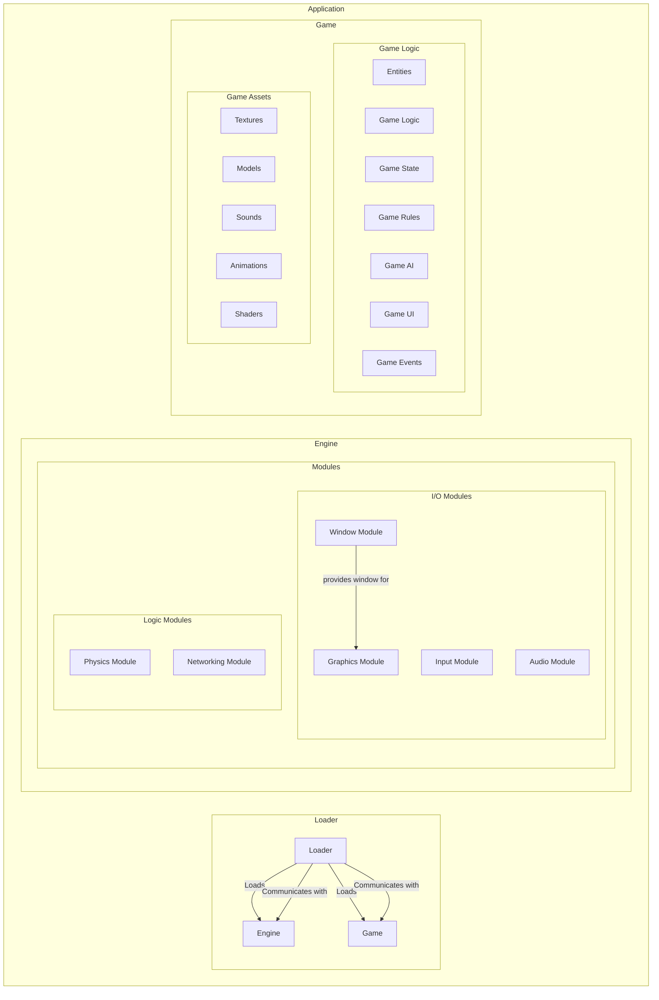

# Engine

This file describes how the engine will work, the structure of the engine, the engine design and why specific chooses were maid.

## Word definitions

| Word | Definition |
|------|------------|
| module | part of the engine which is interchangeable |

## Short breakdown

- the engine should be kept modular so that it is easy to change specific functionality and or apis: e.g., replacing OpenGL later on with Vulkan or making them interchangeable
- defining a universal protocol for modules
- defining a universal protocol for communications between the engine and the game: e.g., the game needs to be able to give the engine infos about what should be rendered and when and what sound should be played, stopped, etc.
- providing a list of all required and optional modules
- what the game is allowed to modify in the engine

## Engine structure

### Game and engine interaction

How I want the engine and the game to interact with each other.

- the game should be able to be loaded without restarting everything: e.g., changing game logic, adding or removing parts of the game, changing assets, etc.
- the engine should also allow for most of its modules to be loaded and unloaded without restarting the engine or game: e.g., changing OpenGL to Vulkan, changing the sound engine, or changes to the underlying protocols, etc.
- I need a persistent loader for both that doesn't close if there are errors in the game, engine or communication between the two

---

Consequences of this are:

- there should be a loader that is persistent and can load the game and engine
- the loader needs to have debugging capabilities to be able to debug the game and engine (only in development)
- the engine is a loader for the different modules
- the engine should be able to load and unload modules at runtime
- the game and the engine need to be able to communicate with each other
- the engine and the loader need to be able to communicate with each other
- the game and the loader need to be able to communicate with each other
- the loader is the main entry point for the game and engine
- the loader manages the game and engine lifecycle and is responsible for coordinating loading and unloading of modules and logic

